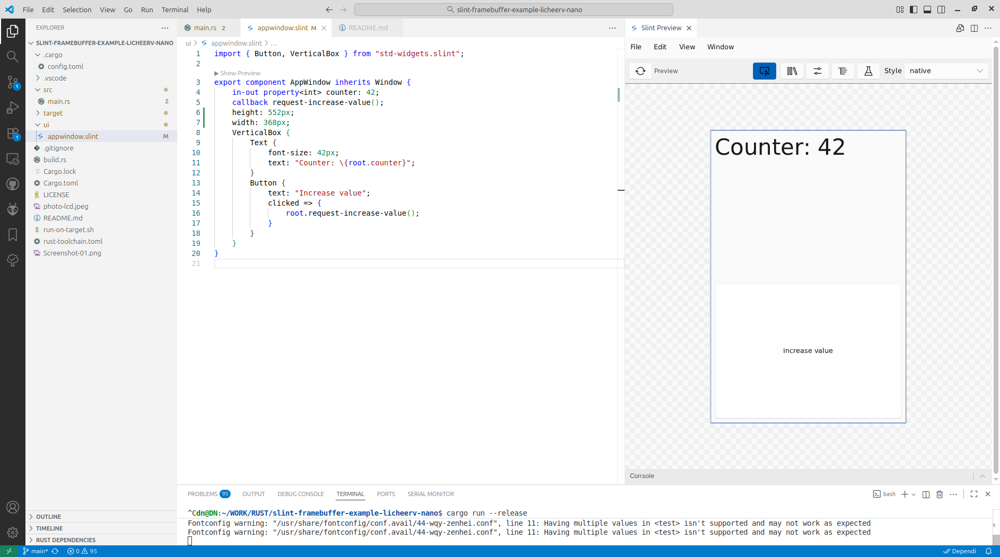
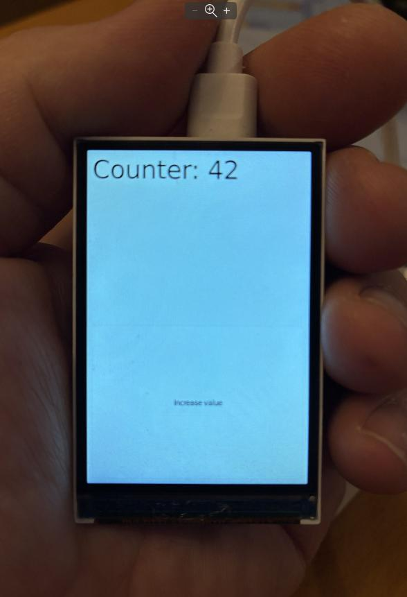

# Slint framebuffer example running on LicheeRV Nano development board 

Thiis is a demo of compiling and running a Slint UI program on a Risc-V 64-bit microprocessor under Linux, using Linux framebuffer.

Pressing the USER button increments the value.

## Hardware

LicheeRV Nano - https://wiki.sipeed.com/hardware/en/lichee/RV_Nano/1_intro.html

IPS 2.28 inch 31-pin ST7701S-based display, resolution is 368*552

## Prepare the target

Flash the SD card image: https://github.com/sipeed/LicheeRV-Nano-Build/releases/tag/20250804

Enable framebuffer and configure the 2.28 inch LCD according to the **LCD** section of the instructions: https://wiki.sipeed.com/hardware/en/lichee/RV_Nano/5_peripheral.html

## Prepare the host environment

To link the program for the riscv64gc-unknown-linux-musl architecture, install riscv64-linux-musl-gcc from https://musl.cc/ . You will need the riscv64-linux-musl-cross.tgz file.

## Compile and run the program

cargo run --release

The run-on-target.sh script will be started, uploading the executable file to the target board and running it. Make sure that this sh file contains the actual IP address of the board.

# Old README.md from https://github.com/nilclass/slint-framebuffer-example is below

https://github.com/nilclass/slint-framebuffer-example/blob/main/README.md

